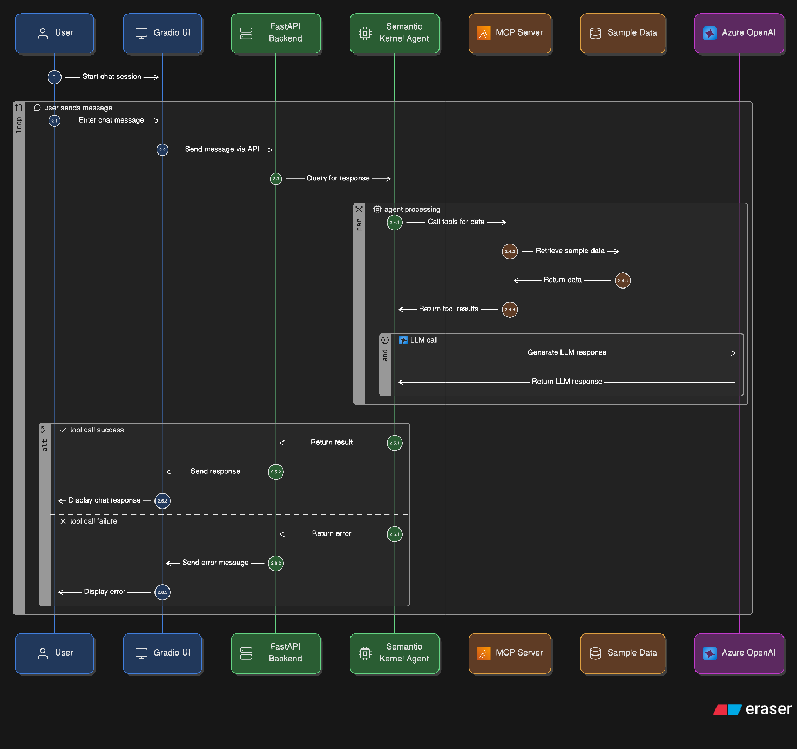

<div align="center">

# 🤖 Azure Ops Copilot

**AI-Powered DevOps Assistant for Azure Operations**

[](https://www.python.org/downloads/)
[](https://opensource.org/licenses/MIT)
[](https://github.com/mahimairaja/azure-agent-ops-copilot/actions/workflows/ci.yml)
[](https://github.com/astral-sh/ruff)
[](https://huggingface.co/spaces/mahimairaja/azure-agent-ops-copilot)

[Demo](https://huggingface.co/spaces/mahimairaja/azure-agent-ops-copilot) • [Documentation](#-features) • [Installation](#-quick-start) • [Contributing](#-contributing)

</div>

---

## ✨ Features

<table>
<tr>
<td width="50%">

### 🔍 **Alert Analysis**
Automatically analyze Azure Monitor alerts with AI-powered root cause identification and remediation suggestions.

### ⚙️ **Configuration Review**
Inspect resource configurations (ARM/Bicep) and check compliance status across your Azure infrastructure.

</td>
<td width="50%">

### 🔧 **Fix Generation**
Generate ready-to-use Bicep templates and Azure CLI commands for common issues and optimizations.

### 💬 **Natural Language Interface**
Chat with your Azure infrastructure using plain English - no complex queries needed!

</td>
</tr>
</table>

---

## 🎯 Demo

Try it live on [Hugging Face Spaces](https://huggingface.co/spaces/mahimairaja/azure-agent-ops-copilot)!

**Example queries:**
```
💬 "Analyze alert alert-001"
💬 "Check config for vm-01"
💬 "Suggest a fix for high CPU on vm-01"
💬 "Summarize the recent logs"
```

---

## 🏗️ Conversation Flow



### Tech Stack

| Component | Technology |
|-----------|-----------|
| **Frontend** |  |
| **Backend** |  |
| **AI Framework** |  |
| **LLM** |  |
| **MCP Server** |  |
| **Package Manager** |  |

---

## 🚀 Quick Start

### Prerequisites

- Python 3.10+
- [uv](https://github.com/astral-sh/uv) package manager
- Azure OpenAI API access

### Installation

1. **Clone the repository**
   ```bash
   git clone https://github.com/mahimairaja/azure-agent-ops-copilot.git
   cd azure-agent-ops-copilot
   ```

2. **Install dependencies**
   ```bash
   uv sync --all-groups
   ```

3. **Configure environment**
   ```bash
   cp .env.example .env
   ```

   Edit `.env` and add your Azure OpenAI credentials:
   ```env
   AZURE_OPENAI_ENDPOINT=https://your-endpoint.openai.azure.com/
   AZURE_OPENAI_API_KEY=your-api-key-here
   AZURE_OPENAI_DEPLOYMENT_NAME=gpt-4o-mini
   ```

4. **Generate sample data**
   ```bash
   uv run python scripts/generate_logs.py
   uv run python scripts/generate_configs.py
   ```

5. **Run the application**

   **Terminal 1** - Start the backend:
   ```bash
   uv run python src/backend/app.py
   ```

   **Terminal 2** - Start the frontend:
   ```bash
   uv run python src/frontend/app.py
   ```

6. **Open your browser**

   Navigate to `http://localhost:7860` and start chatting!

---

## 🐳 Docker Deployment

### Local Docker

```bash
# Build the image
docker build -t azure-ops-copilot .

# Run the container
docker run -p 7860:7860 -p 8000:8000 \
  -e AZURE_OPENAI_ENDPOINT=your-endpoint \
  -e AZURE_OPENAI_API_KEY=your-key \
  -e AZURE_OPENAI_DEPLOYMENT_NAME=gpt-4o-mini \
  azure-ops-copilot
```

### Hugging Face Spaces

This project is configured for one-click deployment to Hugging Face Spaces:

1. Fork this repository
2. Create a new Space on [Hugging Face](https://huggingface.co/new-space)
3. Choose **Docker** as the SDK
4. Connect your GitHub repository
5. Add your Azure OpenAI credentials as Space secrets
6. Deploy! 🚀

---

## 📖 Usage Examples

### Analyze Alerts
```python
# Ask the copilot
"Analyze alert alert-001"

# Response includes:
# - Alert details
# - Severity and resource info
# - Root cause analysis
# - Suggested remediation
```

### Check Resource Configuration
```python
# Query by short name
"Check config for vm-01"

# Or by full resource ID
"Show configuration for /subscriptions/.../virtualMachines/vm-01"
```

### Generate Fixes
```python
# Request fix generation
"Suggest a fix for high CPU on vm-01"

# Get:
# - Bicep template for VM resize
# - Azure CLI commands
# - Best practices
```

---

## 🤝 Contributing

Contributions are welcome! Please feel free to submit a Pull Request.

---

## 📝 License

This project is licensed under the MIT License - see the [LICENSE](LICENSE) file for details.

---

## 🙏 Acknowledgments

- [Semantic Kernel](https://github.com/microsoft/semantic-kernel) - AI orchestration framework
- [FastMCP](https://github.com/jlowin/fastmcp) - Model Context Protocol implementation
- [Gradio](https://gradio.app/) - Beautiful web UI framework
- [Azure OpenAI](https://azure.microsoft.com/en-us/products/ai-services/openai-service) - LLM provider

---

## 📬 Contact

**Mahimai Raja** - [LinkedIn](https://linkedin.com/in/mahimairaja) - [GitHub](https://github.com/mahimairaja)

---

<div align="center">

**⭐ Star this repo if you find it helpful!**

Made with ❤️ by [Mahimai Raja](https://github.com/mahimairaja)

</div>
